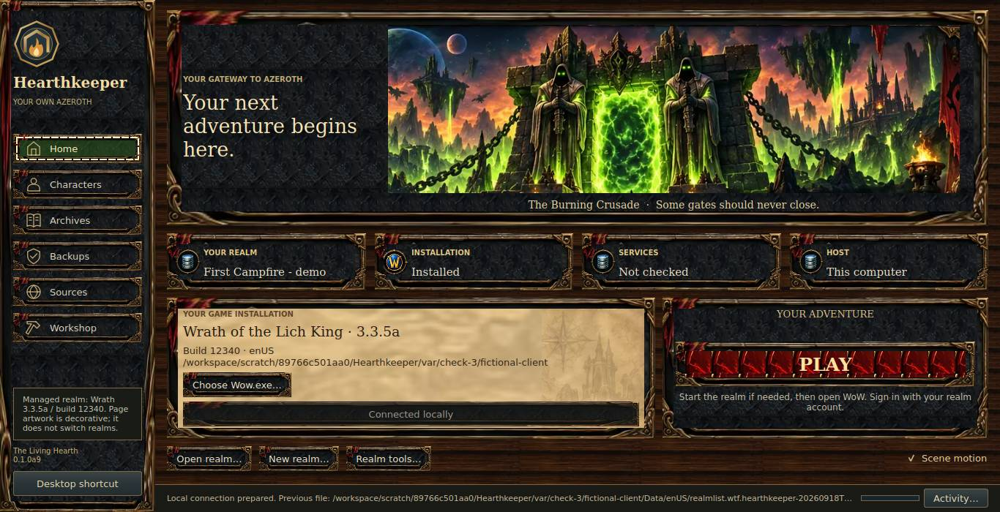

# 0.1.0a9 — The Living Hearth

Home keeps the realm, installation, service state, host, matching client, and Play
on one screen. The header measures the space left by the actual controls, including
wrapped client paths. The complete portal panorama retains its original aspect
ratio. The three existing state indicators keep their real meanings; the new host
plaque says **This computer**, because remote hosting is not implemented yet.

This screenshot comes from the running native application with fictional files
and mocked services. It is not evidence of live WoW gameplay.

## Everyday controls

- **Open realm**, **New realm**, client selection, connection, and Play remain on Home.
- **Realm tools…** opens a separate window with installation, service controls,
  settings, logs, shortcuts, and the Companion guide. Escape closes the window.
- **Activity…** opens the existing full log and **Stop after current step** control.
  The compact footer retains the latest activity line and the real progress bar.
  Hover over truncated activity or status text to read the full value.
- **Scene motion** enables a subtle portal shimmer and drifting motes. Turning it
  off provides a still scene; the choice survives restart. Motion pauses while
  another page is selected, the app is inactive, or the main window is minimized.
  Missing artwork also disables animation and retains the static vector fallback.

The same realm operations, client checks, connection confirmation and backup,
Play orchestration, and launch cancellation are used. No live realm or game data
was used to develop this presentation. Luna migration follows this milestone.

## Materials and performance

This version reuses the verified local a8 atlas. No new asset download, game model,
font bundle, or web view is involved. Parchment uses a quieter continuous texture
and map watermark; disabled Play no longer borrows stray scene pixels from its
old frame. Native controls retain focus indicators and accessibility text.

The optional animation uses a 20 fps Qt timer and repaints only the Home header.
The timer stops when the scene cannot be seen or the application is inactive.
The existing other-page themes remain; Activity is now a separate window shared
by all six pages. The reduced-motion switch is explicit, not an assertion that
every operating system's accessibility settings are automatically detected.

## Verification and acceptance

Native checks cover startup and selected-client states, actual widget containment,
unclipped wrapped text, long realm names, separate tools/activity, persisted motion,
hidden/minimized animation pause, full-panorama geometry, and missing-art fallback.
Logical client areas include 1920×1000, 1536×790, 1366×700, 1280×650, and 980×640.
The smaller work areas reserve room for the Windows title bar and taskbar.

Windows CI builds the executable and repeats native acceptance in the package at
100%, 125%, and 150% Qt scaling, recording the actual device pixel ratio. Workflow
results at the exact PR commit establish which checks passed. The existing 66
unit tests and functional Play acceptance remain in the gates.

For user acceptance, open the existing realm rather than creating a replacement.
Inspect Home at your normal Windows scale, try the tools and activity windows,
and restart once with Scene motion off. Verify Play with the local realm stopped
and already running, then log into the existing gnome. Real Windows display and
gameplay acceptance remain separate from offscreen tests with fictional files.

The PR's **Native desktop** run contains the a9 Windows ZIP. The published a8
release remains available as a fallback until an a9 release is published.
